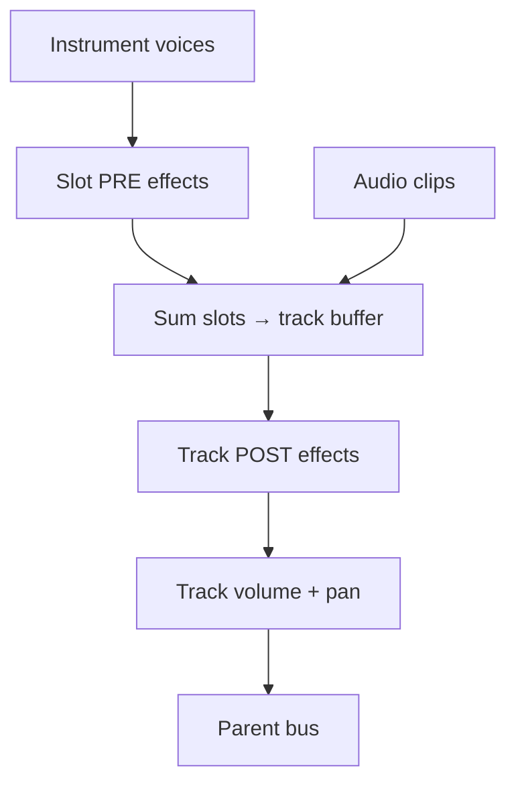

# The audio engine & OS audio APIs

This guide explains how Ongenet actually makes sound: how the engine renders one block of audio, how
audio flows from instruments through effects and buses to the master output, what "real-time safety"
means and why it matters, and how the engine talks to each operating system's audio APIs
(PipeWire/PulseAudio/JACK/ALSA on Linux, CoreAudio on macOS, WASAPI on Windows).

It's written for people new to audio programming. If you haven't read
[creating-instruments.md](creating-instruments.md) and [creating-effects.md](creating-effects.md) yet,
they introduce the vocabulary (samples, frames, blocks, interleaving) used here.

The engine lives in [`Ongenet.Core/Audio`](../Ongenet.Core/Audio) (portable, no native code). The
device drivers live in [`Ongenet.Audio`](../Ongenet.Audio) (the only project that P/Invokes native
audio libraries). The two meet at one small interface, `IAudioOutput`, so the whole DSP side never knows
which OS it's running on.

---

## 1. The pull model: the sound card asks, the engine answers

The most important idea: **audio is pulled, not pushed.** Your sound card runs a relentless clock. Many
times a second it says "give me the next few hundred samples to play, *right now*." The engine's only
job is to fill the buffer it's handed before the deadline. Miss the deadline and you hear a click or a
dropout.

That request is the `AudioRenderCallback`:

```5:10:Ongenet.Core/Audio/IAudioOutput.cs
/// <summary>
/// Pulls audio from the engine: the device repeatedly calls back asking for the next block of
/// interleaved samples to play.
/// </summary>
/// <param name="buffer">Buffer to fill, length = frames × channels (interleaved).</param>
public delegate void AudioRenderCallback(Span<float> buffer);
```

The engine registers its `Render` method as that callback when it starts:

```92:97:Ongenet.Core/Audio/AudioEngine.cs
    public void Start()
    {
        if (_output.IsRunning) return;
        _output.Start(Render);
        RebuildTracks();
    }
```

From then on, the OS driver calls `Render(buffer)` on a dedicated high-priority **audio thread**, over
and over, for as long as audio is running. Everything in the rest of this document happens *inside* that
one call.

### The buffer format

Every buffer in Ongenet — from the sound card down to each instrument and effect — is the same:
**32-bit float, interleaved by channel**, at the engine's current sample rate.

```7:11:Ongenet.Core/Audio/AudioFormat.cs
public readonly record struct AudioFormat(int SampleRate, int Channels)
{
    /// <summary>A common default: 44.1 kHz stereo.</summary>
    public static AudioFormat Default => new(44100, 2);
}
```

- **Interleaved** means stereo samples alternate: `[L, R, L, R, …]`.
- **`frames = buffer.Length / channels`** — a *frame* is one moment across all channels.
- The native drivers below all run at **48 kHz** by default; never hard-code 44,100 in DSP — read the
  rate from the format. (If the device's real rate differs, `IAudioOutput` raises `FormatChanged` and the
  engine re-`Prepare`s everything.)

### Block size is not fixed

How many frames you get per callback (the *block size*) varies by driver — roughly 256 frames on ALSA,
512 on PulseAudio, variable on PipeWire/WASAPI/CoreAudio. DSP code must work for any block length, which
is why instruments and effects always compute `frames` from the buffer length rather than assuming a
constant.

---

## 2. Rendering one block, step by step

Here's the top of `AudioEngine.Render` — the entry point for every block:

```321:335:Ongenet.Core/Audio/AudioEngine.cs
    private void Render(Span<float> buffer)
    {
        buffer.Clear();
        if (_temp.Length < buffer.Length) _temp = new float[buffer.Length];
        if (_slotTemp.Length < buffer.Length) _slotTemp = new float[buffer.Length];

        var channels = _output.Format.Channels < 1 ? 1 : _output.Format.Channels;
        var frames = buffer.Length / channels;

        // Count-in runs before content: emit metronome clicks, keep the playhead parked.
        if (_countingIn) ProcessCountIn(frames);

        var playing = _playing;
        var prevBeat = _currentBeat;
        var curBeat = prevBeat + frames / _samplesPerBeat;
```

Notice `buffer.Clear()` at the very top — the engine **zeroes the buffer first**, which is exactly why
instruments *add* their output (`+=`) instead of overwriting: many sources sum into the same cleared
buffer with no extra copies. The two scratch buffers (`_temp`, `_slotTemp`) are reused fields, grown
only when a bigger block arrives — never freshly allocated per call.

Conceptually, each block does this:

```
Render(buffer):
  clear buffer
  if counting in → metronome clicks
  if playing:
    schedule any MIDI notes that fall in this block (fires NoteOn/NoteOff on instruments)
    apply automation for this block (writes track/effect/instrument parameters)
  for each content track (not a bus):
      for each enabled instrument slot:
          instrument.Render(scratch)              # voices sum into scratch
          run the slot's PRE effects on scratch   # effect.Process(scratch)
          add scratch into the track buffer
      run the track's POST effects on the track buffer
      apply track volume/pan, sum into the track's parent bus
  for each bus, deepest first:
      run the bus's effects
      apply bus volume/pan, sum into its parent (the master sums into the output buffer)
  master limiter + peak metering
```

That's the whole engine in one breath. The rest of this document expands the two interesting parts: the
**signal flow** (how things sum together) and **real-time safety** (why the rules above exist).

---

## 3. Signal flow: instruments → effects → buses → master

### Two effect chains

Audio passes through effects as **inserts** (in series). There are two insert points:

1. **Per instrument slot (pre):** each instrument can have its own effect chain applied right after it
   renders, before it's mixed with the track's other instruments.
2. **Per track (post):** the whole track (all its instruments + any audio clips) passes through the
   track's effect chain.



### Buses are a hierarchy, not sends

Ongenet does **not** have separate "send" faders. Instead, every track has a **parent**: its output
sums into a *group bus*, and group buses sum into other buses or into the *master*. It's a tree.

```26:33:Ongenet.Core/Models/Audio/Track.cs
    /// The <see cref="Id"/> of the group/master bus this track's output routes into, or null to route
    /// straight to the master.
    public Guid? ParentId { get; set; }

    /// <summary>True for a bus (group or master) that sums child output rather than carrying clips.</summary>
    public bool IsBus => Kind is TrackKind.Group or TrackKind.Master;
```

Track kinds are:

```6:22:Ongenet.Core/Models/Audio/TrackKind.cs
public enum TrackKind
{
    Audio,
    Instrument,
    Midi,
    Group,   // sums children
    Master   // root bus
}
```

When the track layout changes, the engine builds a **routing snapshot** — a `Bus` per group/master,
each linked to its parent, ordered *deepest-first*. Ordering deepest-first means one linear pass can mix
children into groups, then groups into the master, with no recursion:

```119:124:Ongenet.Core/Audio/AudioEngine.cs
    // Builds the bus graph from the current tracks: a Bus per group/master, linked to its parent bus,
    // ordered deepest-first so a block can be mixed children → groups → master in a single pass.
    private void BuildRouting(Track[] tracks)
    {
```

### How summing and panning work

Mixing one buffer into another applies a per-channel gain and accumulates. Volume and pan are turned
into left/right gains by [`Mixing`](../Ongenet.Core/Audio/Mixing.cs) — tracks use an equal-power pan law
(constant perceived loudness as you pan), buses use a simpler balance law. The master applies a final
limiter to catch overs, then measures peak levels for the meters you see in the transport bar.

### Sidechain: reading another track

Some effects need a *second* input — the classic "duck the bass when the kick hits" or a vocoder's
carrier. That's the **sidechain bus**: an effect calls `Sidechain.Request(trackId)` and then
`Sidechain.Read(trackId, …)` to get that track's post-effects audio, all on the same audio thread with
no locks. It's a cross-track read, not a routing send. (See
[creating-effects.md §8](creating-effects.md) and
[`SidechainBus.cs`](../Ongenet.Core/Audio/Effects/SidechainBus.cs).)

---

## 4. Real-time safety (the rules, and why)

The audio callback runs under a hard deadline on a high-priority thread. Three things will make it miss
that deadline and produce audible glitches:

1. **Allocating memory.** A `new` array, LINQ, boxing, or string work can trigger the .NET garbage
   collector, which can pause your thread for milliseconds — an eternity in audio time. **Rule: never
   allocate on the audio thread.** Pre-allocate everything in constructors or `Prepare`. (The engine
   itself only grows its scratch buffers when a larger block arrives, then never again.)
2. **Locking.** If the audio thread waits on a lock held by the UI thread, it stalls. **Rule: don't take
   contended locks in `Render`/`Process`.**
3. **Slow or unbounded work.** File I/O, network, decoding — none of it belongs on the audio thread.

So how does the UI safely change things the audio thread is using (add a track, tweak an effect chain,
move a note)? With **immutable snapshots published atomically.** The UI builds a new array off-thread,
then swaps a single `volatile` reference. The audio thread always reads one consistent snapshot:

```44:46:Ongenet.Core/Audio/AudioEngine.cs
    // --- Bus routing (groups + master). Rebuilt whenever the track topology changes; published as a
    //     single immutable snapshot so the audio thread always reads a consistent graph. ---
    private volatile Routing _routing = new();
```

The same pattern appears as `ActiveInstruments`, `ActiveEffects`, `ActiveAutoLanes` on tracks (with
`Commit…()` methods the UI calls to publish changes). Other real-time-safety techniques in the codebase:

- **MIDI from other threads** goes through a `MidiEventFifo` — pushed by the UI/MIDI thread, drained at
  the start of `Process` (see [creating-effects.md §8](creating-effects.md)).
- **Parameter smoothing** with `OnePole` filters avoids "zipper" clicks when a value jumps.
- **Voices never allocate** while rendering; they're pooled and reused.

### Which thread does what

| Thread | Responsibility |
| --- | --- |
| **OS audio thread** | Calls `AudioEngine.Render` each block; runs all instrument/effect DSP and the mix |
| **UI thread** | Edits the project; publishes snapshots via `Commit…()`; reads meters/playhead |
| **MIDI backend thread** | Delivers live hardware MIDI to the preview service |

There's a subtlety worth knowing: **live** notes (playing your keyboard) reach instruments on the
preview path immediately, while **sequenced** notes (clips during playback) are fired on the audio
thread by the engine's scheduler. Both end up calling the same `NoteOn`/`NoteOff` on your instrument.

---

## 5. The device layer: one seam, many backends

The engine depends only on `IAudioOutput`. Everything OS-specific is hidden behind it:

```17:36:Ongenet.Core/Audio/IAudioOutput.cs
public interface IAudioOutput : IDisposable
{
    /// <summary>The format the device runs at (known after <see cref="Start"/>).</summary>
    AudioFormat Format { get; }

    event Action? FormatChanged;

    /// <summary>Whether the device is currently open and streaming.</summary>
    bool IsRunning { get; }

    /// <summary>Opens the device and begins streaming, pulling blocks via <paramref name="callback"/>.</summary>
    void Start(AudioRenderCallback callback);

    /// <summary>Stops streaming and closes the device.</summary>
    void Stop();
}
```

The concrete backend is chosen at startup by the platform layer
([`DesktopPlatform`](../Ongenet.Desktop/DesktopPlatform.cs)): a `LinuxNativeBackend`, `MacNativeBackend`,
or `WinNativeBackend`. The engine never sees the difference — `Start(Render)` is all it does, and blocks
start arriving.

Everything here uses **native OS libraries via P/Invoke** — there is nothing to compile or install. Each
driver simply probes for its system library at runtime and, if present, offers its devices.

---

## 6. Linux: four drivers in parallel

Linux audio is fragmented, so Ongenet ships **four independent drivers** and exposes all of them at
once. Each implements a small internal interface:

```12:38:Ongenet.Audio/Native/INativeAudioDriver.cs
internal interface INativeAudioDriver
{
    /// <summary>Display tag shown in device names, e.g. "ALSA".</summary>
    string HostApi { get; }

    /// <summary>Prefix this driver puts on <see cref="AudioDevice.Id"/>, e.g. "alsa:". Used to route opens.</summary>
    string IdPrefix { get; }

    /// <summary>Whether the subsystem's native library is present and usable on this machine.</summary>
    bool IsAvailable { get; }

    /// <summary>Appends this driver's playback/capture devices to the given lists.</summary>
    void Enumerate(List<AudioDevice> outputs, List<AudioDevice> inputs);

    INativeStream OpenOutput(AudioDevice device, int channels, AudioRenderCallback render);

    INativeStream OpenInput(AudioDevice device, int channels, AudioCaptureCallback capture);
}
```

They are registered in preference order:

```20:26:Ongenet.Audio/Native/NativeDriverRegistry.cs
        _drivers = new List<INativeAudioDriver>
        {
            new PipeWireAudioDriver(),
            new PulseAudioDriver(),
            new JackAudioDriver(),
            new AlsaAudioDriver(),
        };
```

Only the **available** ones (whose native library loads) appear; each one enumerates its own devices and
tags them with a host-API name and an id prefix, so all working subsystems show up together in the
device picker and opens are routed back to the right driver.

| Driver | Native library | Id prefix | How it streams |
| --- | --- | --- | --- |
| **PipeWire** ([`PipeWireAudioDriver`](../Ongenet.Audio/Native/PipeWireAudioDriver.cs)) | `libpipewire-0.3.so.0` | `pw:` | A `pw_stream` on a `pw_thread_loop`; float32, 48 kHz; the engine renders into the SPA buffer in the process callback |
| **PulseAudio** ([`PulseAudioDriver`](../Ongenet.Audio/Native/PulseAudioDriver.cs)) | `libpulse.so.0` / `libpulse-simple.so.0` | `pulse:` | `pa_simple` with `FLOAT32LE`, 48 kHz, on a dedicated thread, 512-frame blocks |
| **JACK** ([`JackAudioDriver`](../Ongenet.Audio/Native/JackAudioDriver.cs)) | `libjack.so.0` | `jack:` | A JACK process callback; ports are non-interleaved mono float, de/interleaved at the edge |
| **ALSA** ([`AlsaAudioDriver`](../Ongenet.Audio/Native/AlsaAudioDriver.cs)) | `libasound.so.2` | `alsa:` | `snd_pcm` in `FLOAT_LE` interleaved access, ~48 kHz, ~256-frame period, dedicated thread |

The interop declarations (the actual `[DllImport]`/`NativeLibrary.TryLoad` calls) live in
[`Ongenet.Audio/Interop`](../Ongenet.Audio/Interop). A driver reports `IsAvailable = false` if its
library can't be loaded, so a machine without JACK simply won't list JACK — nothing breaks.

> **Why so many?** On a typical modern desktop, PipeWire is present and preferred. But ALSA is always
> there as the lowest common denominator, PulseAudio covers older setups, and JACK serves pro-audio
> users. Listing them all lets the user pick the path with the latency/routing they want.

---

## 7. macOS & Windows

The same `IAudioOutput` seam, one backend each:

| OS | Backend | API | Files |
| --- | --- | --- | --- |
| **macOS** | `MacNativeBackend` | CoreAudio — a HAL output AudioUnit, float32 interleaved 48 kHz, render callback → engine | [`Native/Mac`](../Ongenet.Audio/Native/Mac), [`Interop/CoreAudioNative.cs`](../Ongenet.Audio/Interop/CoreAudioNative.cs) |
| **Windows** | `WinNativeBackend` | WASAPI shared-mode, event-driven, device mix format (float32 interleaved), dedicated render thread | [`Native/Win`](../Ongenet.Audio/Native/Win), [`Interop/WasapiNative.cs`](../Ongenet.Audio/Interop/WasapiNative.cs) |

In both cases the pattern is identical: the OS hands the driver a buffer (CoreAudio's render callback,
WASAPI's `IAudioRenderClient` buffer), the driver wraps it as a `Span<float>`, and calls the engine's
`render(span)`.

---

## 8. Picking a device at startup

The platform registers the one native backend for the OS; the
[`AudioBackendManager`](../Ongenet.Core/Audio/AudioBackendManager.cs) selects it (the one with
`Id == "native"`) and hands its render/capture callbacks straight to the active backend's stream — no
extra indirection on the audio path.

For the actual *device*, the native device service aggregates every available driver's devices and then
**reconciles** a default: keep the previously selected device if it's still present, otherwise prefer
whatever is tagged as the system default, otherwise the first device. The user's saved preference (from
**Settings → Audio**) is applied before the engine starts, and changing the selection while running
simply reopens the stream.

---

## 9. MIDI input (briefly)

MIDI has the same shape: one seam, an OS-native implementation chosen at startup
([`MidiInputBackendFactory`](../Ongenet.Audio/Interop/MidiInputBackendFactory.cs)):

| OS | Backend |
| --- | --- |
| **Linux** | ALSA sequencer (`snd_seq`), falling back to ALSA rawmidi |
| **Windows** | WinMM |
| **macOS** | CoreMIDI |

Incoming messages are delivered on the MIDI backend's thread to the preview service, which plays them on
the selected track's instrument. (Clip playback, by contrast, generates MIDI on the audio thread — see
§4.) Live MIDI and the on-screen/computer keyboard all funnel into the same `NoteOn`/`NoteOff` calls your
instrument already implements.

---

## 10. Mental recap for DSP newcomers

1. **The sound card pulls.** The engine fills a buffer on demand; it never decides when it runs.
2. **One format everywhere:** float32, interleaved, at the device sample rate. Read the rate; don't
   assume it.
3. **Block size varies** — never assume a fixed number of frames.
4. **Mixing is additive** into a pre-cleared buffer: instruments add, effects edit in place.
5. **Routing is a tree:** track → parent group bus → master. No separate sends (sidechain is a
   cross-track read).
6. **The audio thread is sacred:** no allocations, no locks, no slow work. The UI talks to it via
   immutable snapshots and lock-free FIFOs.
7. **The OS is hidden** behind `IAudioOutput`; Linux exposes PipeWire/PulseAudio/JACK/ALSA in parallel,
   macOS uses CoreAudio, Windows uses WASAPI — all via P/Invoke, nothing to install.

---

## Key files

| File | Role |
| --- | --- |
| [`Audio/AudioEngine.cs`](../Ongenet.Core/Audio/AudioEngine.cs) | The render loop, scheduling, automation, routing, master mix |
| [`Audio/IAudioOutput.cs`](../Ongenet.Core/Audio/IAudioOutput.cs) | The device seam + render callback |
| [`Audio/Mixing.cs`](../Ongenet.Core/Audio/Mixing.cs) | Volume/pan gain laws and buffer summing |
| [`Audio/AudioBackendManager.cs`](../Ongenet.Core/Audio/AudioBackendManager.cs) | Selects the active backend |
| [`Models/Audio/Track.cs`](../Ongenet.Core/Models/Audio/Track.cs) / [`TrackKind.cs`](../Ongenet.Core/Models/Audio/TrackKind.cs) | Track model + parent routing |
| [`Audio.Native/INativeAudioDriver.cs`](../Ongenet.Audio/Native/INativeAudioDriver.cs) / [`NativeDriverRegistry.cs`](../Ongenet.Audio/Native/NativeDriverRegistry.cs) | Linux driver seam + registry |
| [`Audio.Native`](../Ongenet.Audio/Native) + [`Audio.Interop`](../Ongenet.Audio/Interop) | All the OS drivers and their P/Invoke layers |

---

## Where to go next

- [creating-instruments.md](creating-instruments.md) — write a source that the engine renders each block.
- [creating-effects.md](creating-effects.md) — write an effect the engine inserts into the signal flow.
- [main-window-layout.md](main-window-layout.md) — the meters, transport and mixer UI over this engine.
